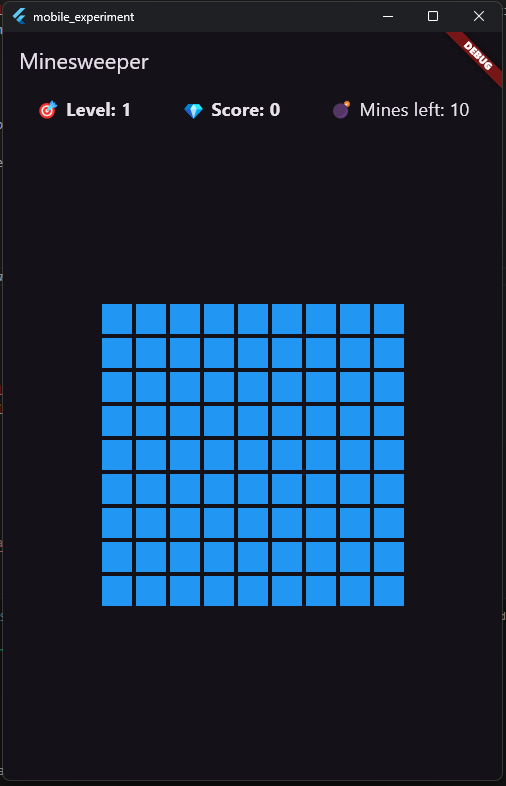

# Minesweeper Flutter Game

A classic Minesweeper game built with Flutter featuring multiple levels of difficulty, scoring based on time and mine clearance, and a rewarding winning streak bonus system.

## Features

- Classic Minesweeper gameplay with safe tile clearing and mines
- Increasing difficulty: more mines added at each level
- Scoring based on number of cleared mines and completion time
- Winning streak bonus multiplier (10% per consecutive win up to 100%)
- Pop-up notifications displaying earned bonus points
- Clean, responsive UI using Flutter widgets
- Cross-platform support: runs on iOS, Android, and desktop

## Screenshots



## Getting Started

### Prerequisites

- Flutter SDK (version 3.0 or higher recommended)  
  Installation guide: [https://flutter.dev/docs/get-started/install](https://flutter.dev/docs/get-started/install)
- An IDE with Flutter support, such as VS Code or Android Studio
- Device or emulator to run the app

### Installation

1. Clone the repository  
```bash
git clone https://github.com/manduulya/minesweeper.git
cd minesweeper-flutter
```

2. Install dependencies
```bash    
flutter pub get 
```

3. Run the app on your connected device or emulator:
```bash
    flutter run
```

### How to Play

- Tap on tiles to reveal them.
- Avoid mines — revealing a mine ends the game immediately.
- Clear all safe tiles to complete the level and move to the next.
- Your score increases with the number of mines cleared and how quickly you complete each level.
- Maintain winning streaks to earn bonus points that multiply your score.
- Bonus points appear as pop-ups and disappear when you tap anywhere.


### Scoring System
- Your score is calculated based on:
- Cleared Mines: Points awarded for each mine safely identified or cleared.
- Completion Time: Faster completion yields higher points.
- Winning Streak Bonus: Each consecutive win increases your score multiplier by 10%, up to 100% at 10 or more wins.

### Winning Streak Bonus
When you win consecutive games, you earn a bonus multiplier on your score.

Example:

2 consecutive wins = 20% bonus points

3 consecutive wins = 30% bonus points

...

10 or more consecutive wins = 100% bonus points

A pop-up notification will display the bonus you earned after each win.

Tap anywhere on the screen to dismiss the pop-up.


### Contributing
Contributions are welcome! Whether it’s fixing bugs, improving UI, or adding features, feel free to open an issue or submit a pull request.

How to contribute:

1. Fork the repository

2. Create a new branch for your feature or bugfix

```bash   
    git checkout -b feature-name
```

3. Commit your changes

4. Push to your branch

```bash    
    git push origin feature-name
```

5. Open a pull request describing your changes

